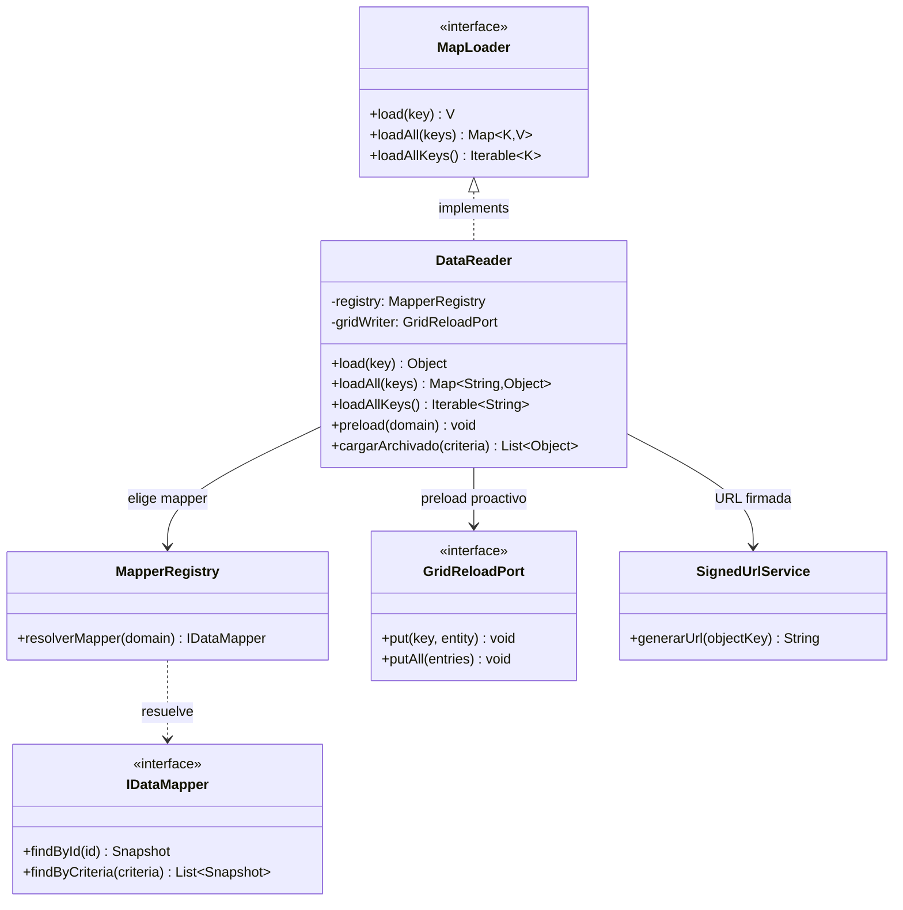

```mermaid
classDiagram
    class MapLoader {
        <<interface>>
        +load(key) V
        +loadAll(keys) Map~K,V~
        +loadAllKeys() Iterable~K~
    }
    class DataReader {
        -registry: MapperRegistry
        -gridWriter: GridReloadPort
        +load(key) Object
        +loadAll(keys) Map~String,Object~
        +loadAllKeys() Iterable~String~
        +preload(domain) void
        +cargarArchivado(criteria) List~Object~
    }
    class MapperRegistry {
        +resolverMapper(domain) IDataMapper
    }
    class IDataMapper {
        <<interface>>
        +findById(id) Snapshot
        +findByCriteria(criteria) List~Snapshot~
    }
    class GridReloadPort {
        <<interface>>
        +put(key, entity) void
        +putAll(entries) void
    }
    class SignedUrlService {
        +generarUrl(objectKey) String
    }
    MapLoader <|.. DataReader : implements
    DataReader --> MapperRegistry : elige mapper
    MapperRegistry ..> IDataMapper : resuelve
    DataReader --> GridReloadPort : preload proactivo
    DataReader --> SignedUrlService : URL firmada
```
