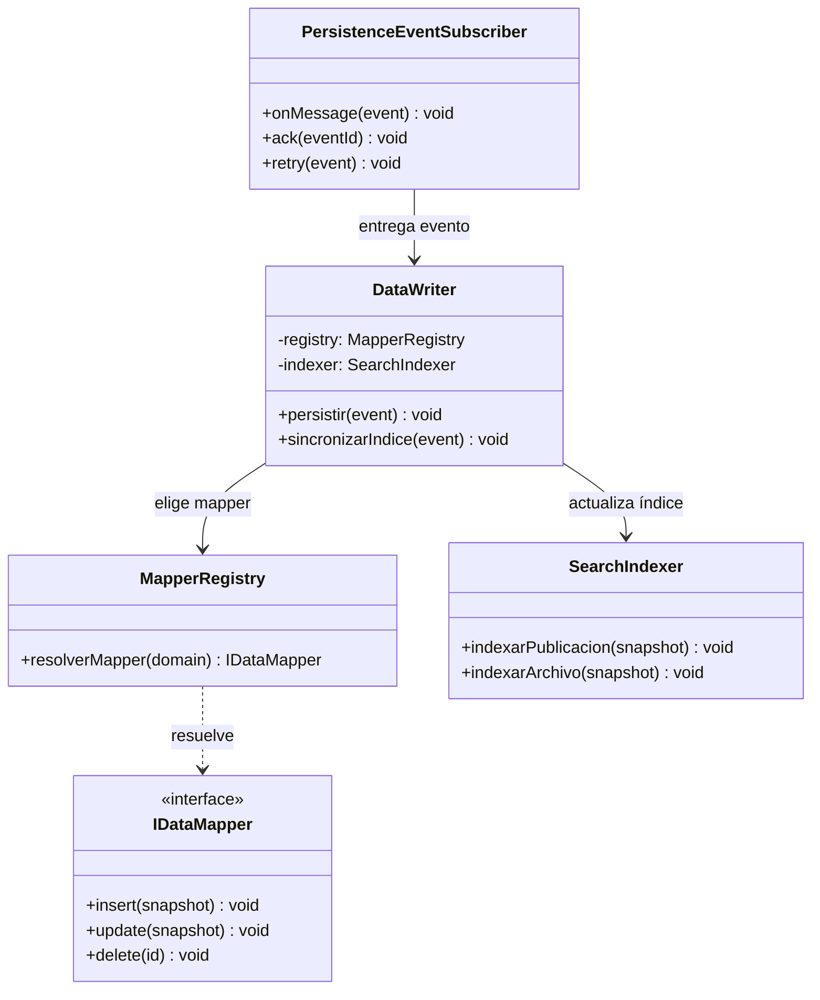

# Diagrama de Clases — Data Writer (Servicio de Persistencia)

```mermaid
classDiagram
    class PersistenceEventSubscriber {
        +onMessage(event) void
        +ack(eventId) void
        +retry(event) void
    }

    class DataWriter {
        -registry: MapperRegistry
        -indexer: SearchIndexer
        +persistir(event) void
        +sincronizarIndice(event) void
    }

    class MapperRegistry {
        +resolverMapper(domain) IDataMapper
    }

    class IDataMapper {
        <<interface>>
        +insert(snapshot) void
        +update(snapshot) void
        +delete(id) void
    }

    class SearchIndexer {
        +indexarPublicacion(snapshot) void
        +indexarArchivo(snapshot) void
    }

    PersistenceEventSubscriber --> DataWriter : entrega evento
    DataWriter --> MapperRegistry : elige mapper
    MapperRegistry ..> IDataMapper : resuelve
    DataWriter --> SearchIndexer : actualiza índice
```
