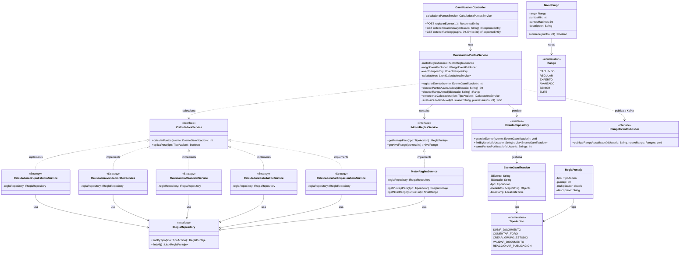

```mermaid
classDiagram
    class GamificacionController {
        -calculadoraPuntosService: CalculadoraPuntosService
        +POST registrarEvento(...) ResponseEntity
        +GET obtenerEstadisticas(idUsuario: String) ResponseEntity
        +GET obtenerRanking(pagina: int, limite: int) ResponseEntity
    }
    class CalculadoraPuntosService {
        -motorReglasService: IMotorReglasService
        -rangoEventPublisher: IRangoEventPublisher
        -eventoRepository: IEventoRepository
        -calculadores: List~ICalculadoraService~
        +registrarEvento(evento: EventoGamificacion) int
        +obtenerPuntosAcumulados(idUsuario: String) int
        +obtenerRangoActual(idUsuario: String) Rango
        +seleccionarCalculadora(tipo: TipoAccion) ICalculadoraService
        +evaluarSubidaDrNivel(idUsuario: String, puntosNuevos: int) void
    }
    class ICalculadoraService {
        <<interface>>
        +calcularPuntos(evento: EventoGamificacion) int
        +aplicaPara(tipo: TipoAccion) boolean
    }
    class CalculadoraGrupoEstudioService {
        <<Strategy>>
        -reglaRepository: IReglaRepository
    }
    class CalculadoraValidacionDocService {
        <<Strategy>>
        -reglaRepository: IReglaRepository
    }
    class CalculadoraReaccionService {
        <<Strategy>>
        -reglaRepository: IReglaRepository
    }
    class CalculadoraSubidaDocService {
        <<Strategy>>
        -reglaRepository: IReglaRepository
    }
    class CalculadoraParticipacionForoService {
        <<Strategy>>
        -reglaRepository: IReglaRepository
    }
    class IEventoRepository {
        <<interface>>
        +guardarEvento(evento: EventoGamificacion) void
        +findByUserId(idUsuario: String) List~EventoGamificacion~
        +sumaPuntosPorUsuario(idUsuario: String) int
    }
    class IMotorReglasService {
        <<interface>>
        +getPuntajePara(tipo: TipoAccion) ReglaPuntaje
        +getNivelRango(puntos: int) NivelRango
    }
    class MotorReglasService {
        -reglaRepository: IReglaRepository
        +getPuntajePara(tipo: TipoAccion) ReglaPuntaje
        +getNivelRango(puntos: int) NivelRango
    }
    class IRangoEventPublisher {
        <<interface>>
        +publicarRangoActualizado(idUsuario: String, nuevoRango: Rango) void
    }
    class IReglaRepository {
        <<interface>>
        +findByTipo(tipo: TipoAccion) ReglaPuntaje
        +findAll() List~ReglaPuntaje~
    }
    class EventoGamificacion {
        -idEvento: String
        -idUsuario: String
        -tipo: TipoAccion
        -metadatos: Map~String, Object~
        -timestamp: LocalDateTime
    }
    class ReglaPuntaje {
        -tipo: TipoAccion
        -puntaje: int
        -multiplicador: double
        -descripcion: String
    }
    class NivelRango {
        -rango: Rango
        -puntosMin: int
        -puntosMaximos: int
        -descripcion: String
        +contiene(puntos: int) boolean
    }
    class TipoAccion {
        <<enumeration>>
        SUBIR_DOCUMENTO
        COMENTAR_FORO
        CREAR_GRUPO_ESTUDIO
        VALIDAR_DOCUMENTO
        REACCIONAR_PUBLICACION
    }
    class Rango {
        <<enumeration>>
        CACHIMBO
        REGULAR
        EXPERTO
        AVANZADO
        SENIOR
        ELITE
    }

    GamificacionController --> CalculadoraPuntosService : usa
    CalculadoraPuntosService ..> ICalculadoraService : selecciona
    CalculadoraPuntosService --> IMotorReglasService : consulta
    CalculadoraPuntosService --> IEventoRepository : persiste
    CalculadoraPuntosService ..> IRangoEventPublisher : publica a Kafka
    ICalculadoraService <|.. CalculadoraGrupoEstudioService : implements
    ICalculadoraService <|.. CalculadoraValidacionDocService : implements
    ICalculadoraService <|.. CalculadoraReaccionService : implements
    ICalculadoraService <|.. CalculadoraSubidaDocService : implements
    ICalculadoraService <|.. CalculadoraParticipacionForoService : implements
    CalculadoraGrupoEstudioService --> IReglaRepository : usa
    CalculadoraValidacionDocService --> IReglaRepository : usa
    CalculadoraReaccionService --> IReglaRepository : usa
    CalculadoraSubidaDocService --> IReglaRepository : usa
    CalculadoraParticipacionForoService --> IReglaRepository : usa
    IMotorReglasService <|.. MotorReglasService : implements
    MotorReglasService --> IReglaRepository : usa
    IEventoRepository ..> EventoGamificacion : gestiona
    EventoGamificacion --> TipoAccion : tipo
    ReglaPuntaje --> TipoAccion : tipo
    NivelRango --> Rango : rango
```
