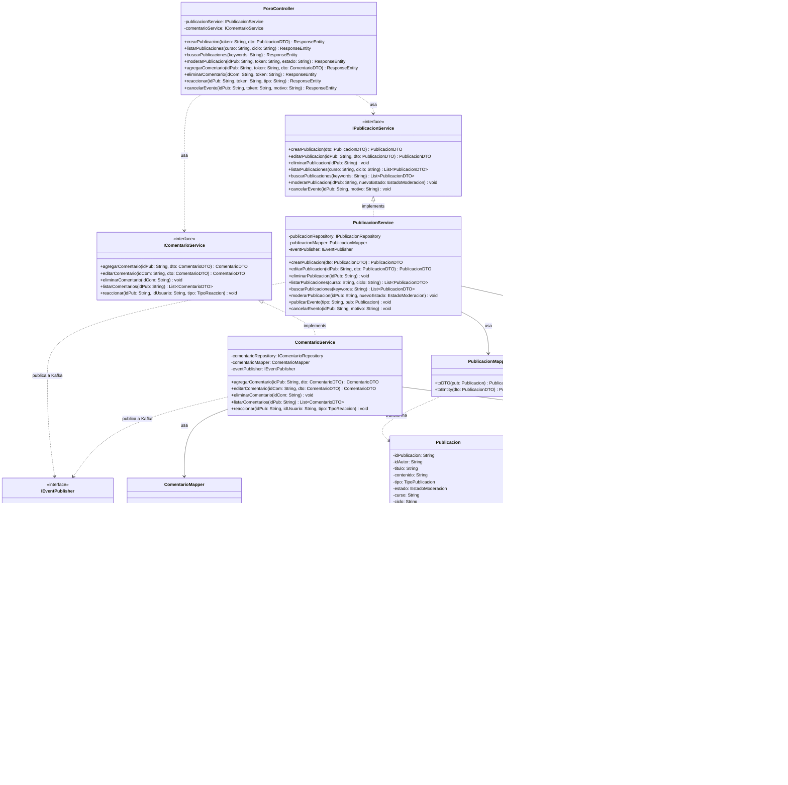

```mermaid
classDiagram
    class ForoController {
        -publicacionService: IPublicacionService
        -comentarioService: IComentarioService
        +crearPublicacion(token: String, dto: PublicacionDTO) ResponseEntity
        +listarPublicaciones(curso: String, ciclo: String) ResponseEntity
        +buscarPublicaciones(keywords: String) ResponseEntity
        +moderarPublicacion(idPub: String, token: String, estado: String) ResponseEntity
        +agregarComentario(idPub: String, token: String, dto: ComentarioDTO) ResponseEntity
        +eliminarComentario(idCom: String, token: String) ResponseEntity
        +reaccionar(idPub: String, token: String, tipo: String) ResponseEntity
        +cancelarEvento(idPub: String, token: String, motivo: String) ResponseEntity
    }
    class IPublicacionService {
        <<interface>>
        +crearPublicacion(dto: PublicacionDTO) PublicacionDTO
        +editarPublicacion(idPub: String, dto: PublicacionDTO) PublicacionDTO
        +eliminarPublicacion(idPub: String) void
        +listarPublicaciones(curso: String, ciclo: String) List~PublicacionDTO~
        +buscarPublicaciones(keywords: String) List~PublicacionDTO~
        +moderarPublicacion(idPub: String, nuevoEstado: EstadoModeracion) void
        +cancelarEvento(idPub: String, motivo: String) void
    }
    class IComentarioService {
        <<interface>>
        +agregarComentario(idPub: String, dto: ComentarioDTO) ComentarioDTO
        +editarComentario(idCom: String, dto: ComentarioDTO) ComentarioDTO
        +eliminarComentario(idCom: String) void
        +listarComentarios(idPub: String) List~ComentarioDTO~
        +reaccionar(idPub: String, idUsuario: String, tipo: TipoReaccion) void
    }
    class PublicacionService {
        -publicacionRepository: IPublicacionRepository
        -publicacionMapper: PublicacionMapper
        -eventPublisher: IEventPublisher
        +crearPublicacion(dto: PublicacionDTO) PublicacionDTO
        +editarPublicacion(idPub: String, dto: PublicacionDTO) PublicacionDTO
        +eliminarPublicacion(idPub: String) void
        +listarPublicaciones(curso: String, ciclo: String) List~PublicacionDTO~
        +buscarPublicaciones(keywords: String) List~PublicacionDTO~
        +moderarPublicacion(idPub: String, nuevoEstado: EstadoModeracion) void
        +publicarEvento(tipo: String, pub: Publicacion) void
        +cancelarEvento(idPub: String, motivo: String) void
    }
    class ComentarioService {
        -comentarioRepository: IComentarioRepository
        -comentarioMapper: ComentarioMapper
        -eventPublisher: IEventPublisher
        +agregarComentario(idPub: String, dto: ComentarioDTO) ComentarioDTO
        +editarComentario(idCom: String, dto: ComentarioDTO) ComentarioDTO
        +eliminarComentario(idCom: String) void
        +listarComentarios(idPub: String) List~ComentarioDTO~
        +reaccionar(idPub: String, idUsuario: String, tipo: TipoReaccion) void
    }
    class IEventPublisher {
        <<interface>>
        +publish(topico: String, evento: Object) void
    }
    class PublicacionMapper {
        +toDTO(pub: Publicacion) PublicacionDTO
        +toEntity(dto: PublicacionDTO) Publicacion
    }
    class ComentarioMapper {
        +toDTO(com: Comentario) ComentarioDTO
        +toEntity(dto: ComentarioDTO) Comentario
    }
    class IPublicacionRepository {
        <<interface>>
        +guardar(pub: Publicacion) void
        +findById(idPub: String) Publicacion
        +findByCursoCiclo(curso: String, ciclo: String) List~Publicacion~
        +findByKeywords(keywords: String) List~Publicacion~
        +actualizar(pub: Publicacion) void
        +eliminar(idPub: String) void
    }
    class IComentarioRepository {
        <<interface>>
        +guardar(com: Comentario) void
        +findById(idCom: String) Comentario
        +findByPublicacion(idPub: String) List~Comentario~
        +actualizar(com: Comentario) void
        +eliminar(idCom: String) void
        +guardarReaccion(reaccion: Reaccion) void
        +existeReaccion(idPub: String, idUsuario: String) boolean
    }
    class PublicacionDTO {
        +idPublicacion: String
        +titulo: String
        +contenido: String
        +tipo: String
        +estado: String
        +autor: String
        +curso: String
        +ciclo: String
        +totalLikes: int
        +totalDislikes: int
    }
    class ComentarioDTO {
        +idComentario: String
        +contenido: String
        +autor: String
        +estado: String
        +fechaCreacion: String
    }
    class Publicacion {
        -idPublicacion: String
        -idAutor: String
        -titulo: String
        -contenido: String
        -tipo: TipoPublicacion
        -estado: EstadoModeracion
        -curso: String
        -ciclo: String
        -fechaCreacion: LocalDateTime
        +getIdPublicacion() String
        +getIdAutor() String
        +getTipo() TipoPublicacion
        +getEstado() EstadoModeracion
        +cambiarEstado(nuevo: EstadoModeracion) void
        +getCurso() String
    }
    class Comentario {
        -idComentario: String
        -idPublicacion: String
        -idAutor: String
        -contenido: String
        -estado: EstadoModeracion
        -fechaCreacion: LocalDateTime
        +getIdComentario() String
        +getIdPublicacion() String
        +getIdAutor() String
        +getEstado() EstadoModeracion
        +cambiarEstado(nuevo: EstadoModeracion) void
    }
    class Reaccion {
        -idReaccion: String
        -idPublicacion: String
        -idUsuario: String
        -tipo: TipoReaccion
        -timestamp: LocalDateTime
        +getIdPublicacion() String
        +getIdUsuario() String
        +getTipo() TipoReaccion
    }
    class EstadoModeracion {
        <<enumeration>>
        PENDIENTE
        APROBADO
        RECHAZADO
        REPORTADO
        ARCHIVADO
        CANCELADO
    }
    class TipoPublicacion {
        <<enumeration>>
        FORO_DISCUSION
        EVENTO_ESTUDIO
    }
    class TipoReaccion {
        <<enumeration>>
        LIKE
        DISLIKE
    }

    ForoController ..> IPublicacionService : usa
    ForoController ..> IComentarioService : usa
    IPublicacionService <|.. PublicacionService : implements
    IComentarioService <|.. ComentarioService : implements
    PublicacionService ..> IEventPublisher : publica a Kafka
    PublicacionService --> IPublicacionRepository : usa
    PublicacionService --> PublicacionMapper : usa
    ComentarioService --> IComentarioRepository : usa
    ComentarioService --> ComentarioMapper : usa
    ComentarioService ..> IEventPublisher : publica a Kafka
    PublicacionMapper ..> PublicacionDTO : crea
    PublicacionMapper ..> Publicacion : transforma
    ComentarioMapper ..> ComentarioDTO : crea
    ComentarioMapper ..> Comentario : transforma
    IPublicacionRepository ..> Publicacion : gestiona
    IComentarioRepository ..> Comentario : gestiona
    IComentarioRepository ..> Reaccion : gestiona
    Publicacion --> TipoPublicacion : tipo
    Publicacion --> EstadoModeracion : estado
    Comentario --> EstadoModeracion : estado
    Reaccion --> TipoReaccion : tipo
    Publicacion "1" o-- "0..*" Reaccion : contiene
    Publicacion "1" o-- "0..*" Comentario : contiene
```
