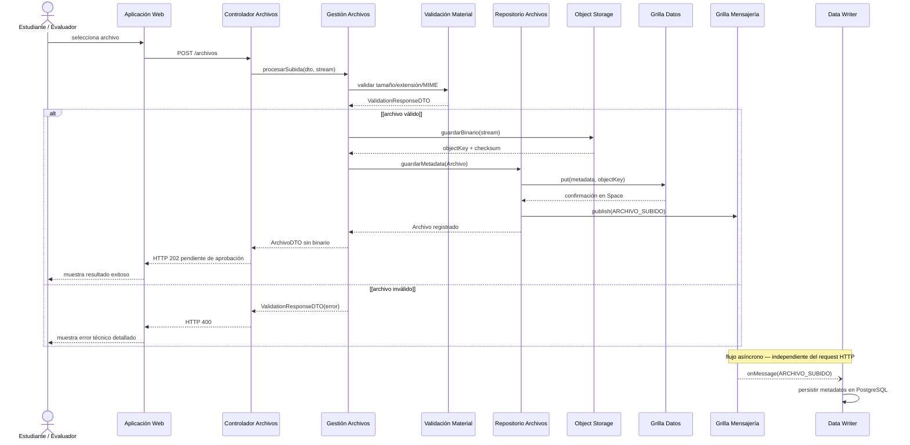

# Diagrama de Interacción — Subida de Archivo (UP Archivos)

```mermaid
sequenceDiagram
    actor U as Estudiante / Evaluador
    participant AW as Aplicación Web
    participant CA as Controlador Archivos
    participant GA as Gestión Archivos
    participant VM as Validación Material
    participant RA as Repositorio Archivos
    participant OS as Object Storage
    participant GD as Grilla Datos
    participant KF as Grilla Mensajería
    participant DW as Data Writer

    U->>AW: selecciona archivo
    AW->>CA: POST /archivos
    CA->>GA: procesarSubida(dto, stream)
    GA->>VM: validar tamaño/extensión/MIME
    VM-->>GA: ValidationResponseDTO

    alt [archivo válido]
        GA->>OS: guardarBinario(stream)
        OS-->>GA: objectKey + checksum
        GA->>RA: guardarMetadata(Archivo)
        RA->>GD: put(metadata, objectKey)
        GD-->>RA: confirmación en Space
        RA->>KF: publish(ARCHIVO_SUBIDO)
        RA-->>GA: Archivo registrado
        GA-->>CA: ArchivoDTO sin binario
        CA-->>AW: HTTP 202 pendiente de aprobación
        AW-->>U: muestra resultado exitoso
    else [archivo inválido]
        GA-->>CA: ValidationResponseDTO(error)
        CA-->>AW: HTTP 400
        AW-->>U: muestra error técnico detallado
    end

    Note over KF,DW: flujo asíncrono — independiente del request HTTP
    KF--)DW: onMessage(ARCHIVO_SUBIDO)
    DW->>DW: persistir metadatos en PostgreSQL
```
