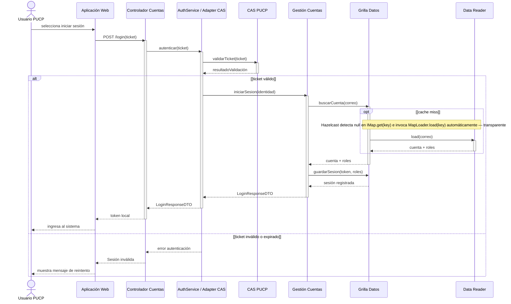

```mermaid
sequenceDiagram
    actor U as Usuario PUCP
    participant AW as Aplicación Web
    participant CC as Controlador Cuentas
    participant AA as AuthService / Adapter CAS
    participant CAS as CAS PUCP
    participant GC as Gestión Cuentas
    participant GD as Grilla Datos
    participant DR as Data Reader

    U->>AW: selecciona iniciar sesión
    AW->>CC: POST /login(ticket)
    activate CC
    CC->>AA: autenticar(ticket)
    activate AA
    AA->>CAS: validarTicket(ticket)
    activate CAS
    CAS-->>AA: resultadoValidación
    deactivate CAS

    alt [ticket válido]
        AA->>GC: iniciarSesion(identidad)
        activate GC
        GC->>GD: buscarCuenta(correo)
        activate GD

        opt [cache miss]
            Note over GD,DR: Hazelcast detecta null en IMap.get(key) e invoca MapLoader.load(key) automáticamente — transparente para GC
            GD->>DR: load(correo)
            activate DR
            DR-->>GD: cuenta + roles
            deactivate DR
        end

        GD-->>GC: cuenta + roles
        deactivate GD
        GC->>GD: guardarSesion(token, roles)
        GD-->>GC: sesión registrada
        GC-->>AA: LoginResponseDTO
        deactivate GC
        AA-->>CC: LoginResponseDTO
        deactivate AA
        CC-->>AW: token local
        deactivate CC
        AW-->>U: ingresa al sistema

    else [ticket inválido o expirado]
        AA-->>CC: error autenticación
        CC-->>AW: Sesión inválida
        AW-->>U: muestra mensaje de reintento
    end
```
