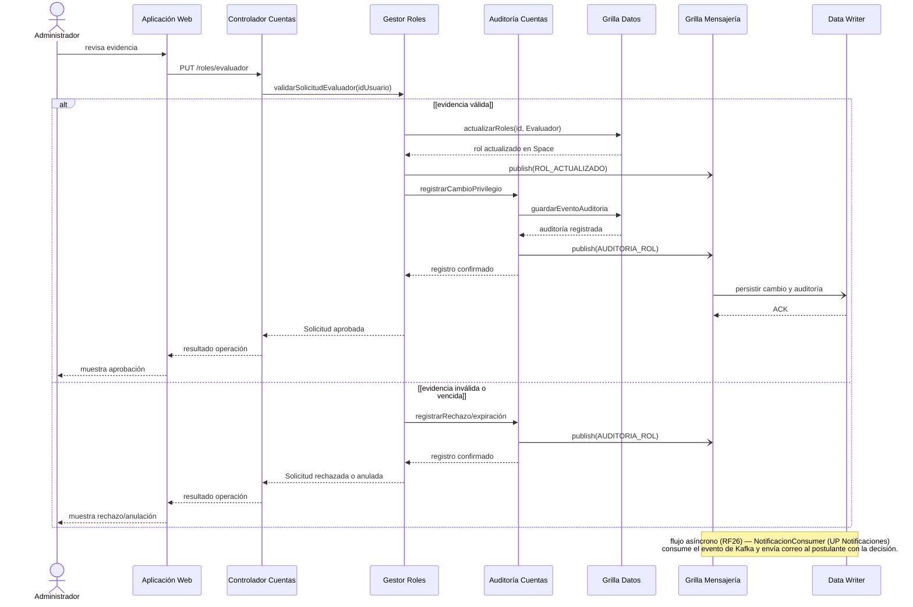

```mermaid
sequenceDiagram
    actor Administrador
    participant AW as Aplicación Web
    participant CC as Controlador Cuentas
    participant GR as Gestor Roles
    participant AC as Auditoría Cuentas
    participant GD as Grilla Datos
    participant GM as Grilla Mensajería
    participant DW as Data Writer

    Administrador->>AW: revisa evidencia
    AW->>CC: PUT /roles/evaluador
    CC->>GR: validarSolicitudEvaluador(idUsuario)

    alt [evidencia válida]
        GR->>GD: actualizarRoles(id, Evaluador)
        GD-->>GR: rol actualizado en Space
        GR-)GM: publish(ROL_ACTUALIZADO)
        GR->>AC: registrarCambioPrivilegio
        AC->>GD: guardarEventoAuditoria
        GD-->>AC: auditoría registrada
        AC-)GM: publish(AUDITORIA_ROL)
        AC-->>GR: registro confirmado
        GM-)DW: persistir cambio y auditoría
        DW-->>GM: ACK
        GR-->>CC: Solicitud aprobada
        CC-->>AW: resultado operación
        AW-->>Administrador: muestra aprobación
    else [evidencia inválida o vencida]
        GR->>AC: registrarRechazo/expiración
        AC-)GM: publish(AUDITORIA_ROL)
        AC-->>GR: registro confirmado
        GR-->>CC: Solicitud rechazada o anulada
        CC-->>AW: resultado operación
        AW-->>Administrador: muestra rechazo/anulación
    end

    Note over GM,DW: flujo asíncrono (RF26) — NotificacionConsumer (UP Notificaciones)<br/>consume el evento de Kafka y envía correo al postulante con la decisión.
```
