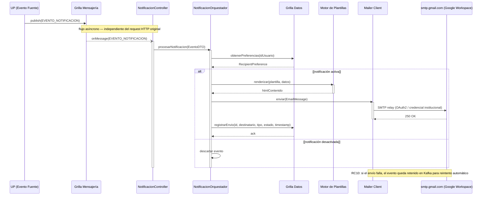

```mermaid
sequenceDiagram
    participant UP_x as UP (Evento Fuente)
    participant KF as Grilla Mensajería
    participant NC as NotificacionController
    participant NO as NotificacionOrquestador
    participant GD as Grilla Datos
    participant TE as Motor de Plantillas
    participant MC as Mailer Client
    participant SMTP as smtp.gmail.com (Google Workspace)

    UP_x->>KF: publish(EVENTO_NOTIFICACION)
    Note over KF,NC: flujo asíncrono — independiente del request HTTP original

    KF--)NC: onMessage(EVENTO_NOTIFICACION)
    activate NC
    NC->>NO: procesarNotificacion(EventoDTO)
    activate NO

    NO->>GD: obtenerPreferencias(idUsuario)
    GD-->>NO: RecipientPreference

    alt [notificación activa]
        NO->>TE: renderizar(plantilla, datos)
        activate TE
        TE-->>NO: htmlContenido
        deactivate TE

        NO->>MC: enviar(EmailMessage)
        activate MC
        MC->>SMTP: SMTP relay (OAuth2 / credencial institucional)
        SMTP-->>MC: 250 OK
        deactivate MC

        NO->>GD: registrarEnvio(id, destinatario, tipo, estado, timestamp)
        GD-->>NO: ack
    else [notificación desactivada]
        NO->>NO: descartar evento
    end

    deactivate NO
    deactivate NC

    Note over MC,SMTP: RC10: si el envío falla, el evento queda retenido en Kafka para reintento automático
```
