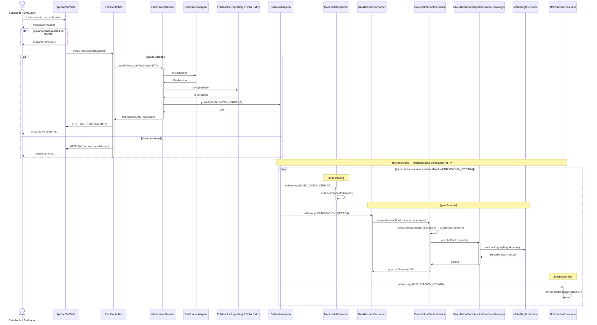

```mermaid
sequenceDiagram
    actor U as Estudiante / Evaluador
    participant AW as Aplicación Web
    participant FC as ForoController
    participant PS as PublicacionService
    participant PM as PublicacionMapper
    participant PR as PublicacionRepository / Grilla Datos
    participant KF as Grilla Mensajería
    participant MOD as ModeradoConsumer
    participant GC as GamificacionConsumer
    participant CPS as CalculadoraPuntosService
    participant CAL as CalculadoraParticipacionService «Strategy»
    participant MRS as MotorReglasService
    participant NC as NotificacionConsumer

    U->>AW: inicia creación de publicación
    AW-->>U: muestra formulario

    opt [usuario cancela antes de enviar]
        AW-->>U: descarta formulario
    end

    AW->>FC: POST /social/publicaciones
    activate FC

    alt [datos válidos]
        FC->>PS: crearPublicacion(PublicacionDTO)
        activate PS
        PS->>PM: toEntity(dto)
        PM-->>PS: Publicacion
        PS->>PR: save(entidad)
        PR-->>PS: id persistido
        PS->>KF: publish(PUBLICACION_CREADA)
        KF-->>PS: ack
        PS-->>FC: PublicacionDTO (resultado)
        deactivate PS
        FC-->>AW: HTTP 201 + PublicacionDTO
        AW-->>U: actualiza vista del foro
    else [datos inválidos]
        FC-->>AW: HTTP 400 (errores de validación)
        AW-->>U: muestra errores
    end

    deactivate FC

    Note over KF,NC: flujo asíncrono — independiente del request HTTP

    loop [para cada consumer suscrito al tópico PUBLICACION_CREADA]
        Note over MOD: [moderación]
        KF--)MOD: onMessage(PUBLICACION_CREADA)
        activate MOD
        MOD->>MOD: evaluar(EstadoModeracion)
        deactivate MOD

        Note over GC,MRS: [gamificación]
        KF--)GC: onMessage(PUBLICACION_CREADA)
        activate GC
        GC->>CPS: registrarEvento(TipoAccion, usuario, meta)
        activate CPS
        CPS->>CPS: seleccionarStrategy(TipoAccion) → ICalculadoraService
        CPS->>CAL: calcularPuntos(evento)
        activate CAL
        CAL->>MRS: evaluarReglas(ReglaPuntaje)
        MRS-->>CAL: ReglaPuntaje / riesgo
        CAL-->>CPS: puntos
        deactivate CAL
        CPS-->>GC: guardar(Evento) / OK
        deactivate CPS
        deactivate GC

        Note over NC: [notificaciones]
        KF--)NC: onMessage(PUBLICACION_CREADA)
        activate NC
        NC->>NC: enviar alertas (NotificacionAPI)
        deactivate NC
    end
```
